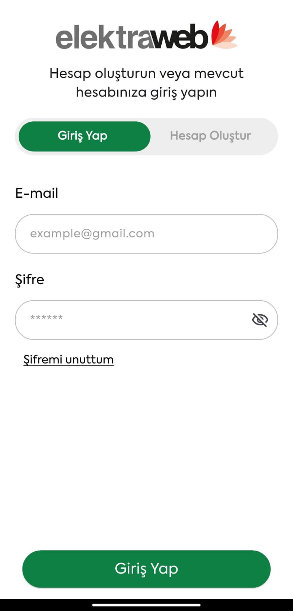
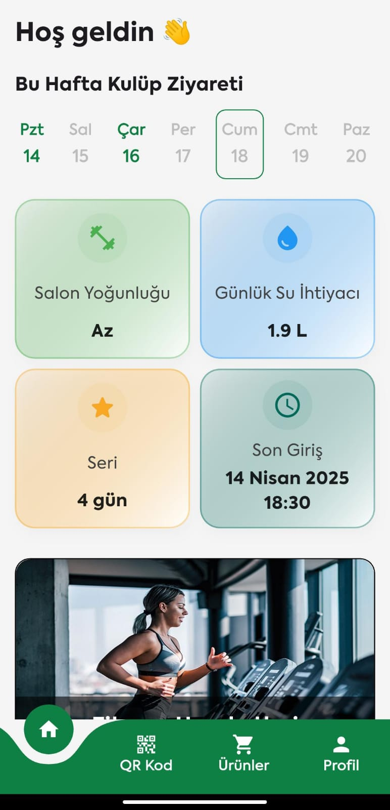
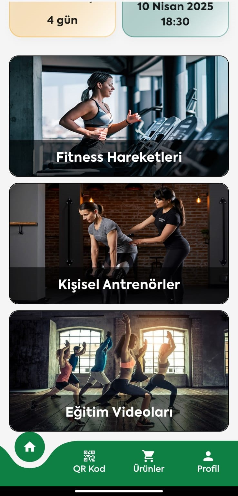
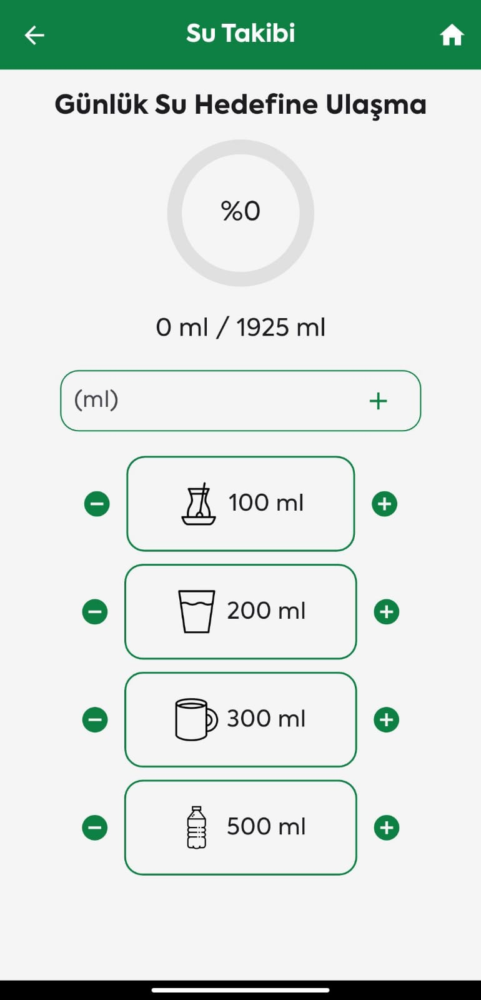
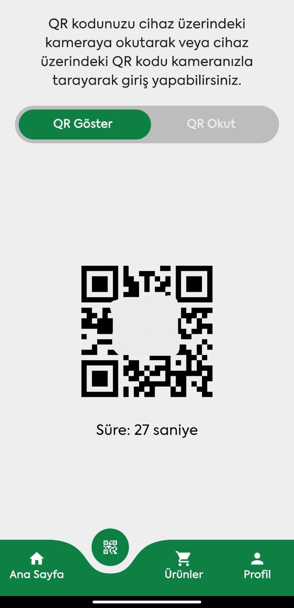
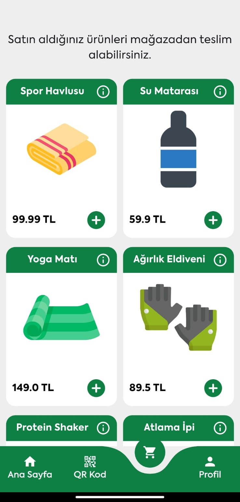
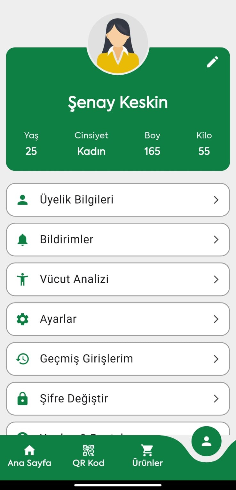
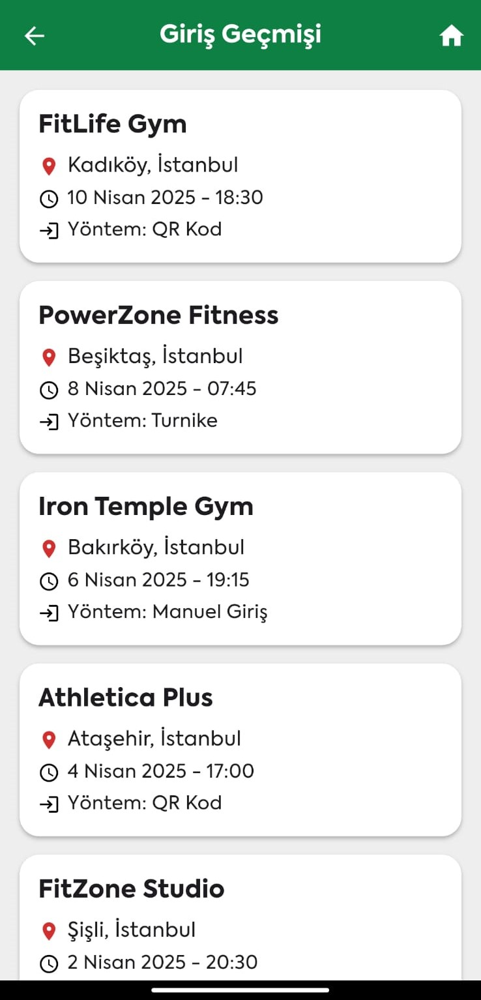
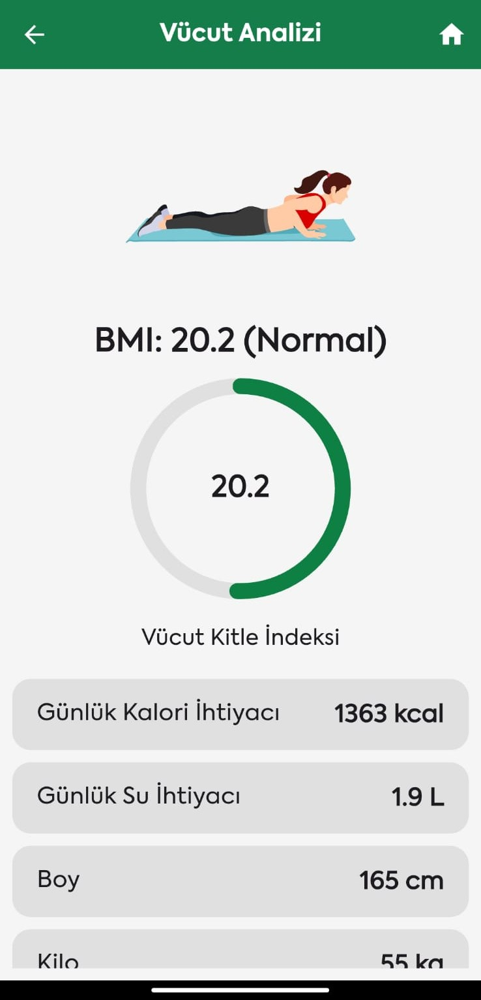

# Fitness App

## 📱 Uygulama Hakkında

Fitness App, kullanıcılara fitness dünyasında kapsamlı bir deneyim sunmak için tasarlanmış bir mobil uygulamadır.
Uygulama, kullanıcıların günlük su ve kalori ihtiyacını takip etme, antrenman geçmişini görüntüleme, ürünler satın alma,
kişisel
profillerini yönetme ve QR kod ile salon girişlerini güvenli bir şekilde yapma gibi birçok özellik sunmaktadır.

Uygulama, modern bir tasarıma sahip olup, kullanıcı dostu arayüzü ile en iyi deneyimi sunmayı hedefler. **Ana Sayfa**,
**QR Kod**, **Ürünler** ve **Profil** olmak üzere dört ana bölümü vardır.

---

## 🔥 Ana Özellikler

- **Ana Sayfa:** Kullanıcılar; salon yoğunluğunu, su ihtiyacını, spor salonuna son giriş tarihini ve salona üst üste
  giriş yaptığı gün sayısını görüntüleyebilirler.
- **QR Kod:** Kullanıcılar salon girişlerini QR kod ile yapabilirler. İster cihaz üzerindeki kodu taratarak isterse de
  uygulama içindeki kodu cihaza okutarak girişi gerçekleştirebilirler
- **Ürünler:** Kullanıcılar, fitness ekipmanları ve aksesuarları gibi ürünler satın alabilir.
- **Profil:** Kullanıcılar; kişisel bilgilerini güncelleyebilir, üyelik paketini değiştirebilir, vücut analizlerini ve
  geçmiş spor salonu giriş bilgilerini görüntüleyebilir, yardım ve destek talebinde bulunabilirler.

---

## 🖼️ Ekran Görüntüleri

Aşağıda, uygulamanın farklı bölümlerine ait ekran görüntüleri bulunmaktadır.

  
  
  

  
  
  

  
  
  

---

## 📲 Teknolojiler

- **Flutter:** Uygulama, hızlı geliştirme ve cross platform desteği için Flutter kullanılarak geliştirilmiştir.
- **QR Code Scanner:** Salon girişlerinde kullanılacak QR kodları için `qr_code_scanner_plus` ve `qr_flutter`
  paketleri kullanılmıştır.
- **State Management:** Uygulama içinde state(durum) yönetimi için BehaviorSubject kullanılmıştır.
- **Animasyonlar:** Animasyonlar için `lottie` paketi kullanılmıştır.
- **Tarih:** Tarihler için `intl` ve tarihlerin Türkçe olarak görüntülenebilmesi için `flutter_localization` paketleri kullanılmıştır.

---
